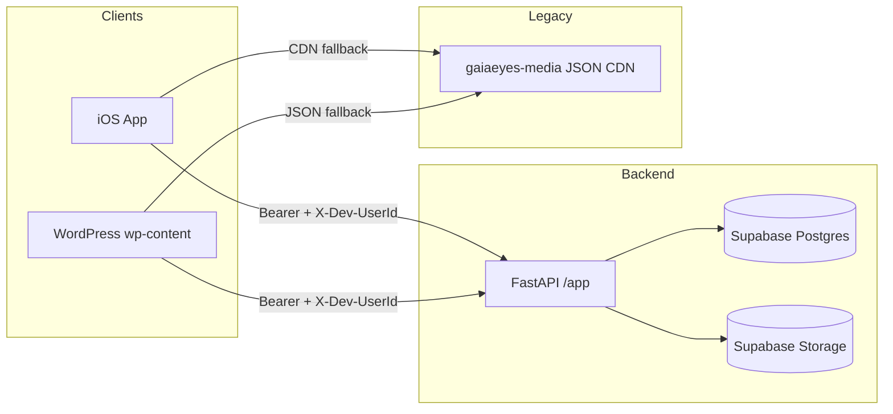
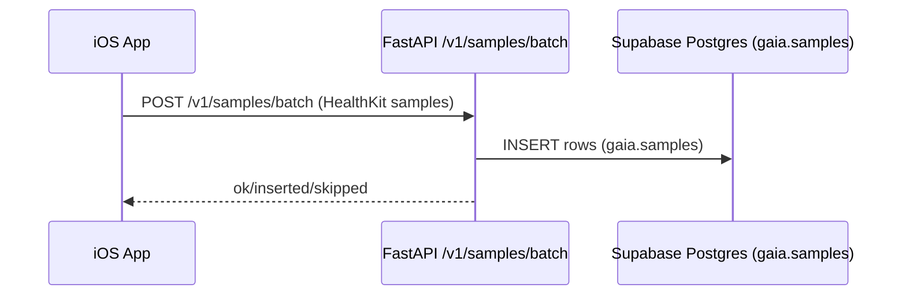
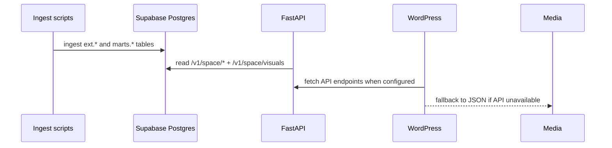
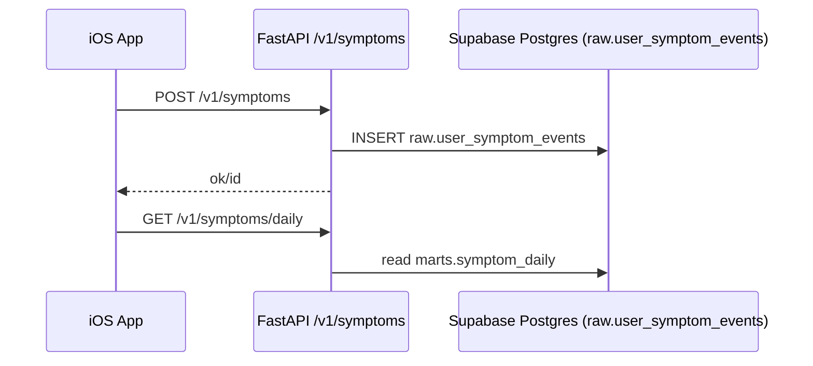

# Architecture

## System overview

## Universal truth
Supabase is the universal data source (Postgres + Auth + Storage). The backend owns writes to Supabase and exposes API endpoints for clients. JSON snapshots (gaiaeyes-media) are legacy fallbacks and are being phased out.

## Data flow: Health samples (iOS → Supabase)

## Data flow: Space weather + visuals

## Data flow: Symptoms

## Key modules (back-end)
- **API entry point**: `app/main.py`
- **Auth**: `app/security/auth.py` + `app/utils/auth.py`
- **DB pool + failover**: `app/db/__init__.py`
- **Core routers**: `app/routers/*.py`
- **Webhook support**: `api/middleware.py`, `api/webhooks.py`

## Key modules (iOS)
- **App state + MVVM**: `gaiaeyes-ios/ios/GaiaExporter/ViewModels/AppState.swift`
- **Networking**: `gaiaeyes-ios/ios/GaiaExporter/Services/APIClient.swift`
- **Background sync**: `gaiaeyes-ios/ios/GaiaExporter/Services/HealthKitBackgroundSync.swift`

## Key modules (WordPress)
- **API helper**: `wp-content/mu-plugins/gaiaeyes-api-helpers.php`
- **Space visuals**: `wp-content/mu-plugins/gaiaeyes-space-visuals.php`
- **Space weather detail**: `wp-content/mu-plugins/gaiaeyes-space-weather-detail.php`
- **Theme shortcodes**: `wp-content/themes/neve/functions.php`

## Known inconsistencies + TODOs (from current repo)
- **Schumann latest endpoint vs schema**: `/v1/earth/schumann/latest` reads `marts.daily_features` columns `f0..f5`, but the migration for `marts.daily_features` does not define those columns. This endpoint likely needs a schema alignment or a different source.
- **Webhook stubs**: `/hooks/*` endpoints are present but include TODOs and do not implement downstream actions yet.
- **Multiple data sources**: several components still fall back to JSON snapshots (gaiaeyes-media) while backend endpoints also exist. This creates duplicate paths that can drift.
- **Media base overlap**: multiple env vars (`VISUALS_MEDIA_BASE_URL`, `MEDIA_BASE_URL`, `GAIA_MEDIA_BASE`) can define the same base URL, which can cause confusion.
