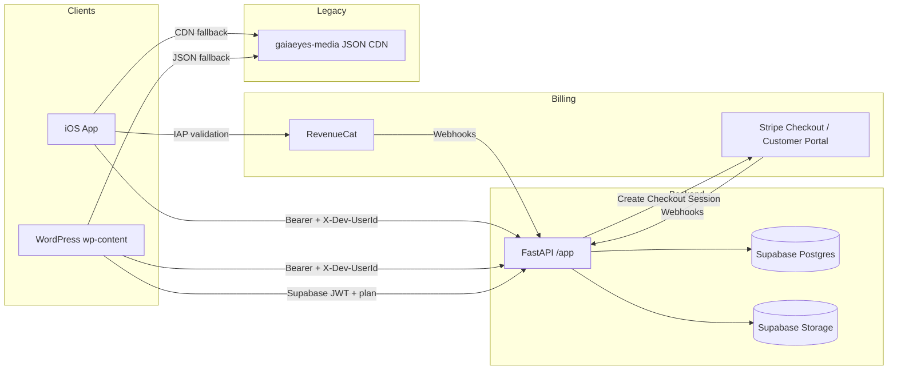
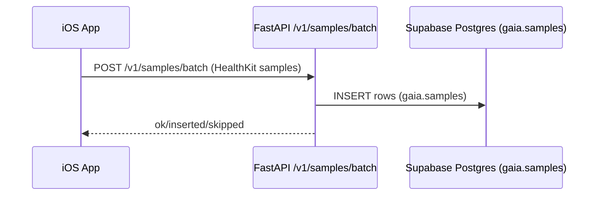
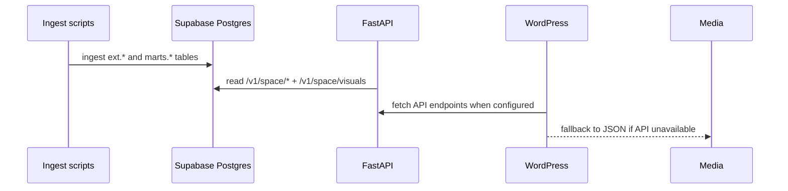
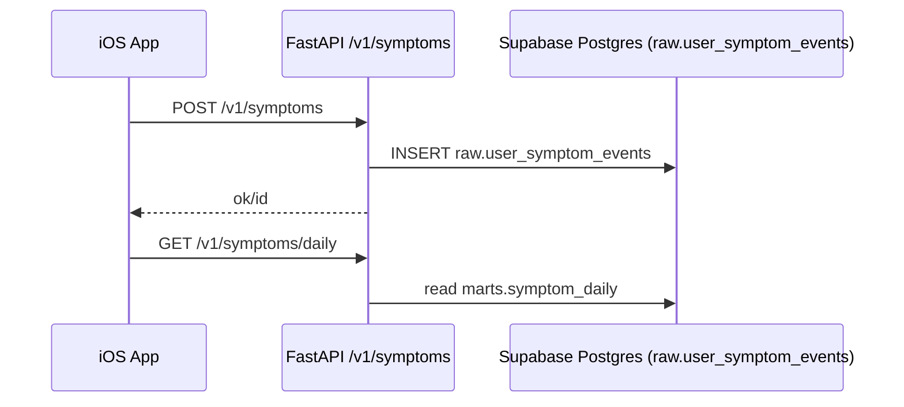
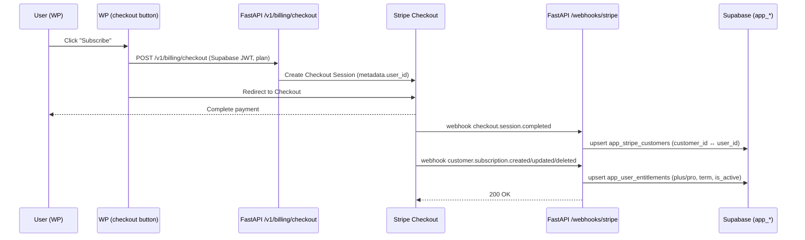
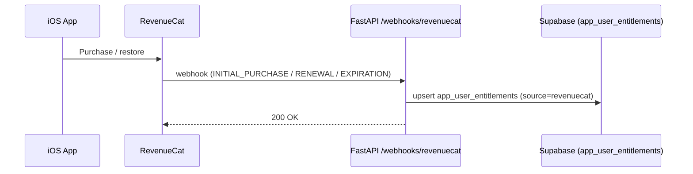

# Architecture

## System overview

## Universal truth
Supabase is the universal data source (Postgres + Auth + Storage). The backend owns writes to Supabase and exposes API endpoints for clients. JSON snapshots (gaiaeyes-media) are legacy fallbacks and are being phased out.

## Data flow: Health samples (iOS → Supabase)

## Data flow: Space weather + visuals

## Data flow: Symptoms

### Data flow: Subscriptions (web via Stripe)

Note: The iOS Subscribe view can use the same `/v1/billing/checkout` flow with a Supabase JWT for direct (non-IAP) subscriptions.

### Data flow: Subscriptions (iOS via RevenueCat)

## Key modules (back-end)
- **API entry point**: `app/main.py`
- **Auth**: `app/security/auth.py` + `app/utils/auth.py`
- **DB pool + failover**: `app/db/__init__.py`
- **Core routers**: `app/routers/*.py`
- **Webhook support**: `api/middleware.py`, `api/webhooks.py`

## Key modules (iOS)
- **App state + MVVM**: `gaiaeyes-ios/ios/GaiaExporter/ViewModels/AppState.swift`
- **Networking**: `gaiaeyes-ios/ios/GaiaExporter/Services/APIClient.swift`
- **Background sync**: `gaiaeyes-ios/ios/GaiaExporter/Services/HealthKitBackgroundSync.swift`

## Key modules (WordPress)
- **API helper**: `wp-content/mu-plugins/gaiaeyes-api-helpers.php`
- **Space visuals**: `wp-content/mu-plugins/gaiaeyes-space-visuals.php`
- **Space weather detail**: `wp-content/mu-plugins/gaiaeyes-space-weather-detail.php`
- **Theme shortcodes**: `wp-content/themes/neve/functions.php`
- **Subscriptions (WP)**: `wp-content/mu-plugins/gaia-subscriptions.php` (Stripe helper), `wp-content/mu-plugins/ge-pricing-table.php` (shortcode wrapper)

## Public API surface (selected)

- `/v1/space/visuals` – gallery of current images (relative paths + `cdn_base`)
- `/v1/space/forecast/outlook` – consolidated space-weather snapshot (now + 24–72h)
- `/v1/space/forecast/summary` – short human-readable summary + flags
- `/v1/hazards/gdacs` and `/v1/hazards/gdacs/full` – GDACS feed (recent + detailed)
- `/v1/local/check?zip=XXXXX` – local health signals (NWS + AirNow + moon)
- `/v1/billing/checkout` – server-created Stripe Checkout (requires Supabase JWT)
- `/v1/billing/entitlements` – current entitlements for signed-in users
- `/webhooks/stripe` – Stripe events (Checkout, Subscription)
- `/webhooks/revenuecat` – RevenueCat events (IAP)
- `/v1/auth/me/entitlements` – active entitlements for the current user

## Known inconsistencies + TODOs (from current repo)
- **Schumann latest endpoint**: RESOLVED — endpoint now reads from `marts.schumann_daily_v2` (and/or updated view). Remove the legacy path after prod verification.
- **Webhook stubs**: `/hooks/*` endpoints are present but include TODOs and do not implement downstream actions yet.
- **Multiple data sources**: several components still fall back to JSON snapshots (gaiaeyes-media) while backend endpoints also exist. This creates duplicate paths that can drift.
- **Media base overlap**: multiple env vars (`VISUALS_MEDIA_BASE_URL`, `MEDIA_BASE_URL`, `GAIA_MEDIA_BASE`) can define the same base URL, which can cause confusion.
- **Wing Kp**: `marts.space_weather_daily.wing_kp*` fields will remain `NULL` until an ingest for Wing Kp is added; track as a follow-up.
- **Env duplication**: consolidate `VISUALS_MEDIA_BASE_URL` / `MEDIA_BASE_URL` / `GAIA_MEDIA_BASE` after WP/iOS switchover is complete.
