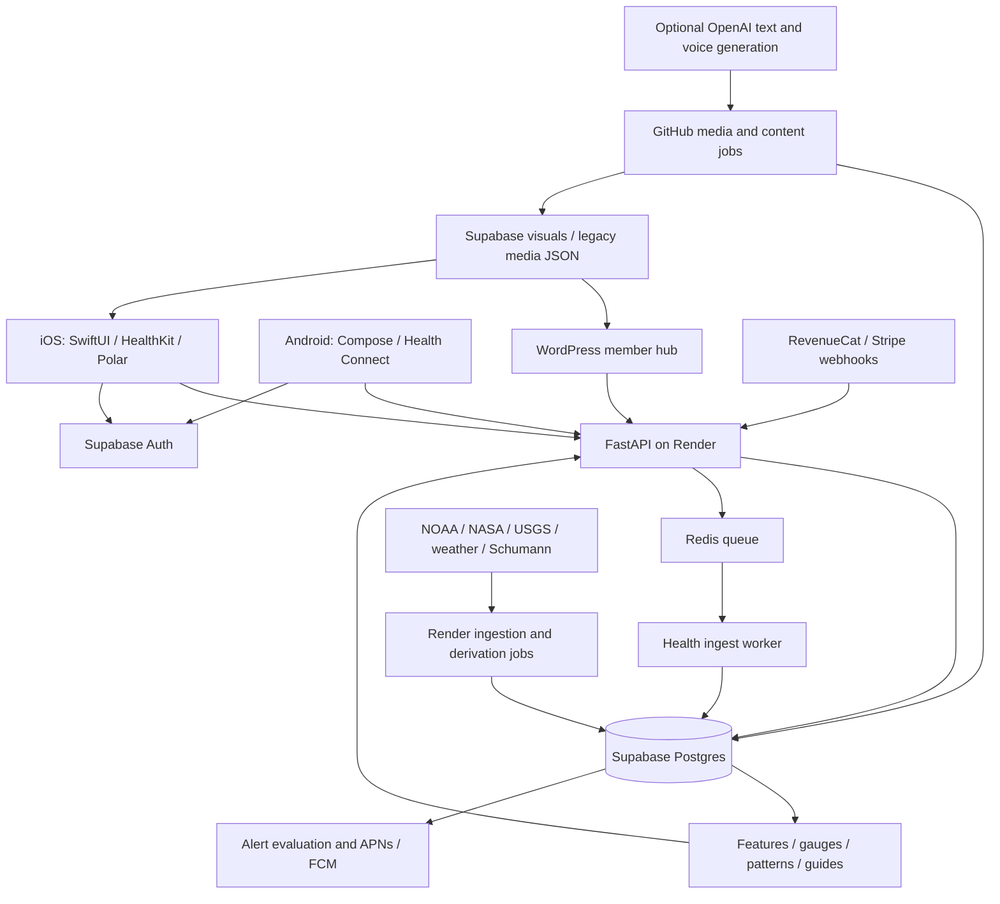

# Gaia Eyes — project state

Reconciled 2026-09-06 UTC / 2026-09-05 America/Chicago. This is a local, uncommitted operational handoff. Review security and business details before any public distribution. Evidence and limitations are in [RECOVERY_AUDIT.md](RECOVERY_AUDIT.md). This dated state takes precedence over older status claims, without replacing implementation specifications.

## Current assessment

Gaia Eyes is an operating iOS health/environment product with a substantial native Android implementation and an active personal/environmental data backend. Both current source trees build locally. Production is **operational with material security and freshness risks**, not fully healthy. The governing near-term strategy is to **build a scalable user-acquisition and engagement system while continuing to improve the product**. Research-level data and increasingly medically meaningful capabilities are part of the long-term direction. Current revenue and cost are context to measure, not an immediate profitability test or a monetary gate on development.

Jennifer confirms iOS is released and an update is underway; Android is unreleased and in development. **September 6 owner update:** Google Play organization verification and app-record creation are complete per Jennifer, superseding the earlier enrollment-pending report. Her subsequent feedback prioritizes Android polish and iOS parity before continued store/release preparation: Explore organization and partial sections, weather discoverability, wording and sluggishness. See the [Android repair brief](../android/ANDROID_POLISH_REPAIR_BRIEF.md). Source review and planning are complete; application repairs, installed-build comparison and performance measurement remain pending. Apple membership conversion remains separate and unverified here. Independent acquisition and iOS work can continue.

## Governing strategy — Jennifer's September 6 correction

This correction supersedes the initial audit's revenue-first milestones and blanket recommendations to pause development until commercial proof. The technical observations below remain dated audit evidence; they have not been remeasured during this documentation correction.

- Gaia Eyes has not yet received sustained serious marketing. Jennifer reports that occasional personal posts in relevant Facebook groups produced some of the strongest download growth, and that several target audiences have shown promising interest and provided useful feedback. This is meaningful owner-reported evidence; exact post/cohort attribution and comparative audience rates remain unmeasured.
- The constraint is Jennifer's capacity to repeat effective acquisition and engagement work. Build a reusable community/channel workflow, content preparation and approval queue, attribution, onboarding and follow-up loop that reduces her recurring workload. Existing Page/reel publishing is a component, not proof that the successful personal-group approach has been reproduced.
- Substantial free functionality and an ad-free experience are deliberate. Grow the user base, learn from free and Plus users, improve value and engagement, and later refine paid gating/Plus value. Low current conversion does not by itself establish weak product value or justify restricting the free product.
- Continue iOS, Android, symptom/migraine, personalization and appropriate research development alongside acquisition work. Default to a viable staged implementation path. A substantive technical, scientific, privacy, legal/regulatory, product, capacity or authorized-budget constraint can alter that path; absence of immediate monetary ROI cannot be the default veto.
- Security and honest data/claim handling remain concrete responsibilities. They constrain affected deployments or data use; they do not create a blanket freeze on product design, local development or growth-system preparation.

## Research and medical capability direction

The [research architecture](/Users/gennwu/Documents/GitHub/gaiaeyes-backend/docs/research-architecture/ARCHITECTURE_REVIEW.md) describes an additive raw-observation → normalized observation → event → feature → model → prediction → hypothesis → report/publication path. The [personalization roadmap](/Users/gennwu/Documents/GitHub/gaiaeyes-backend/docs/NEXT_PHASE_PERSONALIZATION_ROADMAP.md) includes condition contexts, prospective validation and staged product/science review. These are development paths to preserve, not permanent exclusions. “Research-level” is a design and validation objective; this audit did not certify current data as publication-ready or any feature as medically validated.

| Capability stage | Viable work now | Evidence or release condition |
|---|---|---|
| Useful personal health functionality | Improve accurate logging, episode editing, medication/relief history, sensor context, understandable evidence, and user-controlled summaries/exports where scoped | Provenance, correct calculations, privacy, usable workflows and claim wording appropriate to actual behavior |
| Research foundation | Preserve original observations/timestamps/units/source and quality flags; add normalization/algorithm versions, data dictionaries, missingness checks and reproducible analyses alongside current tables | Verify reproducibility and consent/access boundaries; do not infer research consent from using the free app or buying Plus |
| Candidate medically meaningful inference | Define a specific intended use, clinical/user question and comparator; prototype with synthetic or appropriately consented data; record hypotheses, negative results and prospective evaluations | Methods and domain review proportional to the function, including calibration, missing data, false positives/negatives and external validity |
| Stronger validated medical capability | Develop toward a reviewed pilot and eventual release of the intended capability | Establish the evidence, technical controls and applicable scientific, legal/regulatory and product requirements for that specific function before making corresponding claims or releasing it for that use |

Avoiding unsupported medical claims does **not** mean avoiding medical functionality. A disclaimer does not validate a feature or determine its legal/regulatory status. Constraints should identify the actual intended use, evidence gap and route forward. Existing condition-specific prediction/community release gates remain meaningful; they do not forbid foundational engineering, research or useful current functionality.

Raw personal and environmental observations have research value beyond immediate screen use. Cost review must preserve scientifically important originals and provenance under consent/retention obligations. Investigate lossless storage, indexing, compression or verified archival options before any irreversible downsampling/deletion; aggregate-only history is not a substitute for original research inputs.

## Medical framing and repetitive-disclaimer review

This was a static source/document review, not a device traversal or legal assessment. Source occurrences can reveal repetition risks; they do not prove how often a person sees them in a session. No application copy or published policy was changed.

| Surface / evidence | Finding | Recommended disposition |
|---|---|---|
| Initial recovery audit | D01 and the early recommendations could be read as permanently excluding diagnosis/medical capability; paid-user gates and blanket research pauses amplified that narrowing | Superseded here and in the decision/next-action files. Distinguish current validation status from the intended capability roadmap |
| [Research architecture](/Users/gennwu/Documents/GitHub/gaiaeyes-backend/docs/research-architecture/ARCHITECTURE_REVIEW.md) and [master guide](/Users/gennwu/Documents/GitHub/gaiaeyes-backend/docs/GAIA_EYES_CODEX_MASTER_GUIDE.md) | Research observatory/provenance/reproducibility and clinician/researcher audiences are documented; master guide also makes Facebook growth part of the funnel | Restore these as active planning inputs. Current non-diagnostic descriptions do not impose a permanent medical-functionality ceiling |
| [Patterns Phase 1 proposal](/Users/gennwu/Documents/GitHub/gaiaeyes-backend/docs/reviews/launch_audit/PATTERNS_PHASE1_PROPOSAL.md:339) | A lunar-outcome recommendation says to exclude `panic` partly because it feels clinical; surrounding text also raises outcome-specificity concerns | Reassess on construct validity, user need and evidence, not how medical a symptom sounds. Current pattern engine still includes `panic` in a broader outcome; no global removal was established |
| [Android v1 plan](/Users/gennwu/Documents/GitHub/gaiaeyes-backend/docs/android/ANDROID_V1_COMPLETION_AND_PARITY_PLAN.md:205) | Explicitly places medical-purpose disclosure in onboarding/policy rather than repeating throughout the app | Preserve this already-settled UX decision; it predates the correction |
| [Android UI source](/Users/gennwu/Documents/GitHub/gaiaeyes-backend/gaiaeyes-android/app/src/main/java/com/gaiaeyes/app/ui/GaiaEyesApp.kt:611) | Two medical-purpose statements found in inspected main UI: onboarding context (611) and notification settings (1431). No generic diagnostic/treatment footer found across main screens. `PatternsResponse` has an optional disclaimer field with no UI rendering reference found | Review the notification-settings sentence for useful contextual information. Do not claim widespread current Android repetition or remove necessary consent. A model field is not evidence that a disclaimer is displayed |
| [iOS ContentView](/Users/gennwu/Documents/GitHub/gaiaeyes-backend/gaiaeyes-ios/ios/GaiaExporter/Views/ContentView.swift:12523), [camera view](/Users/gennwu/Documents/GitHub/gaiaeyes-backend/gaiaeyes-ios/ios/GaiaExporter/Views/Camera/CameraHealthCheckView.swift:107), onboarding and Understanding Gaia Eyes | Repeated camera “wellness estimate” notices, a Signals to Watch “Context clues, not diagnosis” subtitle, repeated self-reported-context notices, plus onboarding/help disclosures | Traverse the actual journeys before editing. Consolidate generic boilerplate; keep measurement-quality, uncertainty and action-specific context where it helps interpretation. Avoid replacing repeated disclaimers with repeated euphemisms |
| WordPress mu-plugins: API helpers, local check, magnetosphere, aurora, landing, support and legal | Similar non-diagnostic/not-medical-advice statements appear across several product and explanatory surfaces | Review shared copy placement and page journeys with iOS/Android parity. Centralize general disclosure; retain necessary local context and approved legal content |
| Android/Apple release checklists and legal templates | Broad “avoid medical claims”/“not a medical device” descriptions describe current release positioning and can be overread as permanent constraints | Apply evidence-scaled claim review to the specific release. Update public/store/legal descriptions only to match reviewed functionality; no automatic claim strengthening or legal reclassification |

Disposition rule: default general disclosure to onboarding and accessible policy/help. Use a contextual notice when it materially informs the current measurement, uncertainty, consent or action, or when a reviewed requirement calls for it. Never mechanically append a diagnostic/treatment disclaimer to every card. Keep necessary safety, privacy and consent information clear; do not remove useful health capability merely to simplify the disclaimer.

## Architecture

### Backend, identity, data and storage

| Layer | Current implementation | Confidence / limit |
|---|---|---|
| API | Python 3.11, FastAPI, psycopg pools; `app/main.py`, `app/routers`, `app/db` | Source and live public endpoints verified; deployed Render revision unavailable |
| Authentication | Supabase anonymous accounts and email magic links; backend JWT checks plus service/admin routes | Guest accounts are intentional; they are account identities, not necessarily people |
| Client secrets | iOS Keychain and Android Keystore-backed auth storage; config includes public Supabase key | A public client key is expected; secure grants and policies are essential |
| Ingestion | Durable client batching; API → Redis/Valkey → worker, bounded writes; affected-user refresh | Live queue depth zero at both checks, recent native health rows present |
| Database | Primary Supabase project `qadwzkwubfbfuslfxkzl`, PG 17.4.1.074; `gaia`, `raw`, `app`, `ext`, `marts`, `content`, `public` | Schema/catalog/live aggregates verified; security findings below |
| Schema roles | `gaia`: native health; `raw`: logs/check-ins/exposures/analytics; `app`: profiles/location/push; `ext`: feeds; `marts`: derived daily state/patterns; `content`: public/member output; `public`: billing | Some legacy objects remain; existence does not prove active consumption |
| Media | Public `space-visuals` bucket plus legacy `gaiaeyes-media` JSON/CDN assets | Public environmental media is expected; no file-size limit set on bucket; private-object content audit not performed |
| Additional Supabase project | `space-weather-track`, `dzutofwgdagzwdlrmioc`, active, separate region | Purpose, traffic, owner and invoice contribution unverified; do not remove |
| Notifications | Stored preferences, evaluation queue, APNs and FCM send paths | Sent status proves pipeline activity, not delivery or notification engagement |
| Diagnostics | Health/pool/queue endpoints, monitor scripts, local app logs, bug-report route/email status | No dedicated crash SDK found in inspected client source; store crash metrics unavailable |

### iOS

SwiftUI with AppState-driven loading, shared API models/services and a very large `Views/ContentView.swift`. This is the established architecture; its size raises regression risk but does not justify a rewrite during recovery.

Implemented: dashboard/gauges, environmental views and visuals, personal patterns, guide/interpretation preferences, onboarding/profile/baseline inputs, daily check-ins, symptom and migraine event flows, local caching, notifications, RevenueCat purchase/restore paths, HealthKit authorization/observer/anchored imports and historical backfill, and Polar BLE integration. Existing current-symptom updates/deletion and follow-up respond/dismiss routes already support the general symptom flow; the planned richer migraine-specific workflow should not be confused with absence of all follow-ups. The pinned Polar SDK is 6.10.0; RevenueCat is 5.67.2. Optional camera-based wellness measurement is present; it is not a clinically validated measurement claim.

HealthKit is optional. Imported samples retain provenance and types. Background execution and observer registration exist, but a simulator build cannot establish physical background reliability, permission handling, BLE or camera accuracy. Thirty-day backfill is implemented. **September 9 D028:** Migraine Buddy Listing PDF and Bearable CSV samples have been received privately; H09 availability is resolved. They are personal originals, not redacted fixtures, and provider compatibility remains unverified. Import work follows completion of migraine logging, follow-up, medication, editable events and calendar, with no new order among those five. Reports and the existing outreach hold remain committed. See [MIGRAINE_IMPORT_REFERENCES.md](MIGRAINE_IMPORT_REFERENCES.md); this is separate from HealthKit backfill.

**September 10 local migraine checkpoint:** G-011/G-012 are accepted locally; independent review passed G-R20/G-R21 and the original G-R22 sequence. G-013 acceptance remains withheld for G-R23, whose uncertain medicine-save repair is now [review_ready](G013_ACTIVE_WORK.md). Exact pending requests survive response loss without reappending an addition; later external changes require explicit review. Fresh evidence is 12 Swift model/workflow cases, 6 actual editor UI journeys, an actual Swift request checked through unchanged backend retry logic with persistence mocked, and the rebuilt unsigned arm64 Release simulator boundary. The initial UI bundle has 5 passes and one navigation failure; the focused rerun passes that case. Prior 55 backend cases and other G-R20–G-R22 evidence are retained, not rerun. The earlier 102 backend cases correctly divide into 37 executing PostgreSQL, 2 pre-connect guards and 63 others. Activation stays default off. Independent acceptance, physical-device/release verification and Android/member-hub parity remain separate. G-014 is inactive until G-013 acceptance. D028 and the reports/outreach commitments remain unchanged.

Siri/App Intents migraine-start and stop support **already exists on main**. A separate dirty July checkout contains a later alternate generic resolver, expanded natural-language phrases, offline/no-active states and related UI/test changes. Device history records Siri choosing between Gaia Eyes and Health and sometimes requiring repeated attempts. Main build success does not validate those worktree changes or resolve Siri routing ambiguity.

Public Apple metadata: app ID 6761451455, bundle `com.gaiaeyes.GaiaExporter`, version 1.0.1, released 2026-07-23, minimum OS 18.5, seller Jennifer Randall. Local project also says 1.0.1, build 8. Public version equality does not mean local code is the shipped build. App Store Connect/TestFlight/signing/submission/crash status were login-blocked. US lookup reports zero ratings; this is not a global review count.

**Audit validation:** unsigned generic iOS Simulator build, scheme `GaiaEyes`, succeeded. No store submission, device install or physical-device acceptance occurred.

### Android

Native Kotlin, Jetpack Compose/Material 3, Ktor networking, Supabase authentication, account-scoped repositories/caches, WorkManager retry queues and Health Connect integration. Package `com.gaiaeyes.app`; minSdk 28, target 36, compile 36.1; development version 0.1.0-dev / code 1. Home/Body/Explore/Patterns/Outlook/profile/logging and onboarding have substantial implementation. Consult the [Android parity matrix](/Users/gennwu/Documents/GitHub/gaiaeyes-backend/docs/android/ANDROID_PARITY_MATRIX.md) with its date and current source, not as release certification.

Health Connect imports sleep, steps, heart rate, resting heart rate, respiratory rate and oxygen saturation. Recent foreground synchronization uses a two-day window and approximately 15-minute throttle; manual backfill covers 30 days. Background work drains pending uploads; it is not proof of fresh background Health Connect reads. Android HRV RMSSD is intentionally not relabeled as iOS SDNN. No separate Wear OS app or direct Android wearable transport was established; compatible device data can reach the app through Health Connect.

FCM registration and notification-channel creation are implemented. The backend platform constraint migration `20260812144904` is applied and allows Android; old notes saying the migration is outstanding are superseded. No Android push tokens exist in the live token aggregate. Release registration, actual FCM delivery and permission behavior still need device acceptance.

**Release readiness:** Google organization-account verification and Play app-record creation are complete per Jennifer (portfolio D010–D011); do not reopen enrollment. D012 prioritizes Android quality/iOS parity before further release preparation. Release signing/store configuration and Health Connect declarations remain unverified; RevenueCat Android settings are placeholders with **no purchase SDK or purchase/restore implementation found**; store products and entitlement integration need validation. There is no Android-specific CI workflow in the inspected workflow inventory. Native data is real: 2,136 Health Connect samples from one account in the rolling 30-day window, most recently August 29.

**Audit validation:** `:app:testDebugUnitTest :app:lintDebug :app:assembleDebug` succeeded, 76 unit tests, zero failures/errors/skips, 14 lint warnings. This is a debug/source baseline, not release or physical-device certification.

### Subscriptions, analytics and AI

| Surface | Verified | Missing / consequence |
|---|---|---|
| iOS billing | RevenueCat client integration; backend entitlement state | No live sandbox purchase, restore, refund, cancellation or provider dashboard reconciliation |
| Web billing | Stripe checkout and webhook implementation; main mounts `app/api/webhooks.py` under `/v1` | Duplicate/legacy webhook modules need route-aware review; audit did not exercise payments |
| Entitlements | Four current Plus access grants: one manual yearly, one RevenueCat monthly, one RevenueCat yearly, one Stripe monthly | Access grants are not MRR. Anonymous executable entitlement mutation is a critical integrity risk; reconcile with providers after containment |
| Analytics | iOS durable event buffer, backend ingest/summary, WordPress admin analytics page, 3,555 rolling-30-day events from 44 account IDs | No trustworthy install→activation→retention→payment attribution; no Android events observed; health-related properties and account-switch queue handling need review |
| Personalized interpretation | Deterministic gauges/patterns/guides; scientific/mystical presentation preference; optional member text rewrite | Correlations are not validated causal or clinical predictions |
| AI generation | Public/member EarthScope generation and optional OpenAI rewrite/TTS; member workflow specifies `gpt-4o-mini`, TTS path `gpt-4o-mini-tts` | Actual billed models, request volume and spend unavailable; inspected member prompt includes derived health/gauge context, not merely public weather |
| Chat | No native in-app chat route/UI identified in inspected source; WordPress admin has an AI Agent plugin entry | Plugin implementation/configuration and live use/cost were unavailable; cannot conclude chat does not exist anywhere |

## Scheduling and pipelines

Cadences below describe source configuration, not verified execution SLAs. All precise timestamps below are UTC from 2026-09-06 checks around 04:05 unless a date is shown. Source observation time, ingestion time and forecast validity are different fields. Daily personal derivations/gauge comparisons use America/Chicago day; forecast/event datasets also carry validity intervals. Preserve explicit units, UTC offsets and source station/provenance.

Render declares three lanes: critical every 15 minutes, events at minute 13 every two hours, daily at 10:35 UTC. The critical lane has eight ordered steps covering space current/live context, ULF, Schumann extract/ingest, local current, daily current rollup and gauges. The daily lane derives forecasts, health reconciliation, daily features, locations, gauges and patterns. Worker concurrency, timeouts, retries and partial-failure cache behavior are bounded in `scripts/run_render_cron.py` and the job implementations. Failures can leave a previously good row visible; a successful HTTP response or fresh cache timestamp is not proof of fresh input.

| Feed / source | Ingestion and storage | Cadence / time evidence | Reliability, presentation and value |
|---|---|---|---|
| Kp, solar wind, IMF/Bz — NOAA SWPC | Critical space-current Python fetch/upsert → `ext.space_weather`, daily rollups | 15 min; latest observation 03:56 | Active, visible drivers/charts; retain as core environmental context; inspect observation age on source failure |
| X-ray/flares — SWPC GOES | Live-context fetch → X-ray series/flare context | 15 min; X-ray 03:55 | Active, app displays/alerts/context; retain; flare-event age alone is not staleness |
| SEP/energetic particles — SWPC | Live-context fetch → `ext` particle/proton series | 15 min; 03:50 | Active; context and radiation driver; retain summarized presentation, not unsupported health causation |
| DRAP — SWPC | Grid ingestion → `ext.drap_absorption` and derived radio context | 15 min; 03:56 | Active and costly in storage: 29.9 GB; user value of full historical grids unmeasured; retain current summary while reviewing retention design |
| Aurora — SWPC OVATION | Grid/nowcast ingestion → `ext.aurora_nowcast_samples`, visuals | 15 min current; 03:56 | Current main data; separate staging image workflow failing its TS assertion; visible map/context; distinguish the two paths |
| CME/DONKI — NASA | Event lane → `ext` DONKI event tables | Every 2 hours; ingestion 02:13 | Active; useful space context. Check ingestion and event/arrival times separately |
| ENLIL/CME forecasts, scoreboard — SWPC/NASA products | Daily forecast fetch → forecast/cache tables, visuals | Daily; ENLIL fetched Sep 5 10:38; space forecast refreshed 04:00 | Forecast validity/arrival uncertainty matter more than event age; visible forecast context; keep while measuring use |
| Coronal holes — forecast sources in bots | Forecast ingestion → `ext.ch_forecast` | Daily configured; exact latest source value not separately verified | 1.30 GB relation; exploratory predictive value, audit retention and duplication before removing |
| Magnetosphere — configured model/visual sources | GHA fetch → pulse/model/visual products | Latest row Sep 5 23:58; materially older than frequent configured schedule | Visible context, cadence degraded/unverified. Anonymous mutation RPC is separately risky; do not retry blindly |
| Plasmapause | Model/visual handling referenced in visuals pipeline | No independent live scalar feed/production freshness established | Treat as visualization/model context; avoid asserting a measured local exposure |
| Schumann — Tomsk/Cumiana imagery and station paths | Image extraction, validation and ingest → `ext` measurements, daily features/media | Frequent critical/GHA lanes; `ext` latest 04:01 | Active extraction path, source imagery can lag. `marts.schumann_telemetry_v2` empty; not evidence that all Schumann is dead. Station/time-zone normalization needs source-specific acceptance |
| ULF / geomagnetic context | ULF ingest → `ext` records/API | Critical; latest 03:55; public latest endpoint 200 | Active environmental context; not an established personal-health causal predictor |
| Magnetometer chain | Defined schema/pipeline references | `ext.magnetometer_chain` empty | Experimental/unverified; do not present as active data coverage |
| Ionosphere / TEC | Research architecture and proposal material | No separately verified active TEC production series | Research candidate; define question, source/quality/spatial contract and bounded prototype. Health-facing inference needs evidence; research development is not gated on immediate revenue |
| Earthquakes — USGS | Event fetch/upsert → earthquake tables/media | Every 2 hours; ingestion 02:13 | Active, visible map/explore/context; relevance to personal repeated value unmeasured |
| Hazards — GDACS/global sources | Event fetch → global hazard table/media | Every 2 hours; ingestion 02:13 | Active global hazards. Legacy `ext.gdacs_alerts` is empty; do not confuse that with active global table |
| Weather/pressure/humidity/temperature — NWS and configured providers | Local-current fetch → `ext.local_signals_cache`; per-location features | 15 min; final ZIP 78754 wrapper 04:16, embedded asof/observation 03:55 at 04:27 | User-facing source lag despite cache refresh; seven forecast days, zero pollen days; core to trigger hypothesis; make unavailable explicit |
| AQI — AirNow; pollen provider/config | Local fetch and forecast paths | Critical/daily; independent source freshness not certified | AQI implemented. Pollen coverage absent for checked location, not proof of universal outage; API access/config/coverage require review |
| Solar radiation forecasts/bulletins | Daily forecast job → `ext`/forecast views | Latest radiation Sep 5 10:25 | Daily cadence plausible; retain sourced, bounded explanations |
| Moon phase/solar-cycle context | Deterministic calculations / periodic source context | Computed/periodic, not all are ingestion feeds | Presentation/optional user hypothesis; no proof of physiological effects; no separate expansion justified |
| Space visuals — SWPC/NASA/station assets | GHA fetch/render → public bucket/media + API | Public generated 01:00, table updated 01:01 | API 200; individual source images not all inspected. Retain current assets, validate source timestamp independently |
| HealthKit / Health Connect | Native permissioned import → queue → `gaia.samples` → summaries/features | Event/foreground/background dependent; recent iOS source rows; Android last Aug 29 | Core personal layer. Source differences preserved. Physical no-loss/account-boundary behavior still a release gate |
| Symptoms/check-ins/exposures | Authenticated routes → raw events → summaries/patterns | User initiated plus derivations | Active low-volume canonical data; migraine follow-up/import breadth remains partial; highest near-term product relevance |
| Gauges/patterns | Daily + affected-user compute → `marts` | Five actionable lagging gauges persist at 04:27 | Core user-facing risk even with healthy ingestion. Samples, comparisons and confidence gates exist; prospectively validated forecasting does not |
| Public/member EarthScope | GHA daily/content jobs + member generation → `content` + media/WP | Current member rows and successful member job; WP publish job failed | Paid coverage recovered; public/member delivery are separate. Avoid more creative changes before finishing current ones |

## Live health and release boundaries

Public liveness/readiness, DB pool and queue checks passed. At the first check pool backend was direct, five connections were free, no waiters and no queued batches. Local safe connectivity probes and final monitor results are recorded in the audit evidence. Today's features and seven-day user outlook were present for the monitor identity. Those observations do not certify every account or endpoint.

The complete Chicago-day gauge cohort was 33 rows. At 04:04, 27 were over an hour old, 20 were non-calibrating and old, and five also had newer same-day source inputs. At 04:27, the counts were 24, 17 and **five** respectively; newest gauge update was 04:21. A scheduled critical interval elapsed, but authenticated Render logs were unavailable, so successful lane execution is not certified. The persistence supports focused per-user refresh investigation.

The latest inspected Aurora staging workflow failed at “Basic assertions (fail if no TS)”; WP daily publication failed at “Publish to WordPress.” Several other workflows succeeded. Disabled research/social workflows may be intentional; do not enable them automatically.

**Security:** anonymous API grants exposed counts for personal derived-health relations and a Stripe mapping table; a SECURITY DEFINER entitlement-writing function is anonymously executable with no caller-ownership guard in its inspected definition. Read-only evidence and a bounded containment plan are in [RECOVERY_AUDIT.md](RECOVERY_AUDIT.md#security-and-privacy-findings). No mutation was tested and no personal row content was fetched for the access checks. This is an exposure finding, not evidence of prior malicious access.

Backend deploy settings, secrets, current Render revision and actual cron logs remain login-blocked. GitHub main equals local HEAD `3a31b5d1aafd4f7c74ed9054509819267c677a38`. WordPress deployment maps main to staging and production branch/manual production to live; docs/legal is not among its copied sources. Existing `.github/workflows/ios-ci.yml` supports build validation, not unattended App Store release. Android release automation is not established. No releases or external account changes were made by this audit.

## Canonical continuation

Read [DECISION_LOG.md](DECISION_LOG.md) before changing direction, [OPEN_WORK.md](OPEN_WORK.md) before starting implementation, and [RECOMMENDED_NEXT_ACTIONS.md](RECOMMENDED_NEXT_ACTIONS.md) for the bounded next sequence. [PMF_STATE.md](PMF_STATE.md) contains the business evidence; [HUMAN_INPUT_NEEDED.md](HUMAN_INPUT_NEEDED.md) contains the actual decisions/access needed. Preserve the existing dirty main and detached worktrees.
