# Gaia Eyes Website Overview & Maintenance Guide

This guide maps the Gaia Eyes WordPress front-end (staging: https://staging2.gaiaeyes.com/) to its code, data feeds, and operational checks. Use it as the single reference when editing the mu-plugins that power the scientific dashboards.

## Status Snapshot

| Item | Value |
| --- | --- |
| Sections covered | 11 major dashboards & widgets (new Hazards Brief) |
| External assets tracked | 86 unique URLs (see `ASSET_INVENTORY.json`) |
| Sparkline helper adoption | Space Dashboard & Space Weather sections now use `GaiaSpark.renderSpark` |
| Nightly asset audit | `.github/workflows/site-assets-check.yml` runs HEAD checks for every URL in the inventory |

## Site Map

```mermaid
graph TD
  RootHome["Homepage (/)"] --> HazardsBrief[["[gaia_hazards_brief]"\nmu-plugins/gaia-hazards-brief.php]]
  RootSpaceDashboard["Space Dashboard (/space-dashboard/)"] --> SWDetail[["[gaia_space_weather_detail]"\nmu-plugins/gaiaeyes-space-weather-detail.php]]
  RootSpaceDashboard --> SpaceDetail[["[gaia_space_detail]"\nmu-plugins/gaiaeyes-space-visuals.php]]
  RootSpaceDashboard --> KPBadge[["gaiaeyes-kp-badge.php"\nHeader badge injector]]
  RootAurora["Aurora Tracker (/aurora-tracker/)"] --> AuroraDetail[["[gaia_aurora_detail]"\nmu-plugins/gaiaeyes-aurora-detail.php]]
  RootSchumann["Schumann Resonance (/schumann-resonance/)"] --> SchumannDetail[["[gaia_schumann_detail]"\nmu-plugins/gaiaeyes-schumann-detail.php]]
  RootMagneto["Magnetosphere (/magnetosphere/)"] --> MagnetoDetail[["[gaia_magnetosphere_detail]"\nmu-plugins/gaiaeyes-magnetosphere.php]]
  RootCompare["Compare (/compare/)"] --> CompareDetail[["[gaia_compare_detail]"\nmu-plugins/gaiaeyes-compare-detail.php]]
  RootQuake["Earthquakes (/earthquakes/)"] --> QuakeDetail[["[gaia_quakes_detail]"\nmu-plugins/gaiaeyes-earthquake-detail.php]]
  RootNews["News (/news-2/)"] --> NewsDetail[["[gaia_news_latest]"\nmu-plugins/gaiaeyes-news.php]]
```



## Quick Start for Local Edits

1. **Environment** – These pages are delivered via WordPress mu-plugins in `wp-content/mu-plugins/`. Edits to PHP or inline JS/CSS take effect immediately on deploy; there is no build pipeline.
2. **Python helpers** – Asset checks and media tooling rely on the existing virtualenv; install deps with `python -m pip install -r requirements.txt`.
3. **Editing workflow** – Update the relevant mu-plugin, clear WordPress object cache (if using a persistent cache), and reload the staging page. For JSON-driven sections, you can override URLs via shortcode attributes for testing.
4. **Previewing** – Use the staging site (https://staging2.gaiaeyes.com/) for verification. Since these sections are shortcode-driven, create a draft page with the shortcode to preview without affecting production content.

## Preview on Staging

* Flush the page cache from the WordPress dashboard if CDN caching is enabled.
* Append `?nocache=1` while testing JSON refreshes; the shortcodes cache upstream data with 5–10 minute transients.
* The staging header injects the language widget; ensure any new overlays keep `z-index` ≥ 30 so they sit above the translation dropdown.

## Sparkline Helper Mini-API

All spark charts now share `wp-content/mu-plugins/gaiaeyes-spark-helper.php`, which exposes:

```js
GaiaSpark.renderSpark(canvasOrId, data, {
  xLabel: 'UTC time',
  yLabel: 'IMF Bz',
  units: 'nT',
  yMin: 0,
  yMax: 9,
  color: '#7fc8ff',
  zeroLine: true,
  tension: 0.25
});
```

* `data` accepts arrays of `{x, y}` objects, `[timestamp, value]` tuples, or simple numeric arrays.
* Axes (including units) render automatically, with padding and 10px+ fonts for mobile legibility.
* `zeroLine: true` draws a dashed baseline (used for IMF Bz).
* The helper dispatches a `gaiaSparkReady` event; use the provided `whenSparkReady` pattern (see mu-plugins) to defer rendering until it loads.
* Empty datasets keep the canvas clear and set `data-gaia-spark-empty="1"`, allowing optional CSS fallbacks.

## Adding a New Image or Plot

1. Place the asset in `gaiaeyes-media` (or confirm the upstream JSON references it).
2. Update the relevant JSON feed (`space_live.json`, `space_weather.json`, etc.) so the shortcode picks it up.
3. Adjust the mu-plugin markup to add a `<figure>`/`` block. Reuse the existing `ov-grid`/`ge-card` classes for spacing.
4. Add the new URL to `docs/web/ASSET_INVENTORY.json` (run the Playwright asset gatherer) so the nightly workflow monitors it.
5. For heavy media (>2 MB), provide a static JPEG fallback or gated download link.

---

## TODOs & Recommendations

| Issue | Impact | Recommendation |
| --- | --- | --- |
| `images/space/ccor1_20251102T203604Z.mp4` (~6.2 MB) | Large download in Space Dashboard cards | Consider transcoding a lighter preview GIF/MP4 or lazy-loading behind a click. |
| Language dropdown overlaps card headings on narrow viewports | Blocks spark axes | Add `.trp-language-switcher { z-index: 40; right: 12px; }` so it floats above content without clipping labels. |

---

## Section Guides

### Hazards Brief (Homepage snapshot)

* Location: Homepage hero region (auto-injected ahead of content via `the_content` filter).
* Shortcode: `[gaia_hazards_brief url="https://gaiaeyeshq.github.io/gaiaeyes-media/public/hazards/latest.json" cache="5"]`
* PHP: `wp-content/mu-plugins/gaia-hazards-brief.php`

**DOM outline**

```
- section.gaia-hazards-brief
  - header.ghb-head (title + timestamp)
  - div.ghb-row
    - div.ghb-card (severity counts)
    - div.ghb-card (type counts)
    - div.ghb-card (top highlights + digest link)
```

**Data flow & caching**

* Fetches `public/hazards/latest.json` with a configurable 5-minute transient.
* `hazards.yml` GitHub Action runs every 10 minutes to rebuild and publish `latest.json`.
* If the hazards digest category has published posts, the card links to the newest article.

**Presentation notes**

* CSS lives inline inside the shortcode for self-containment; cards stack on mobile and switch to 3-column ≥768 px.
* Severity badges map to `red`, `orange`, `yellow`, `info`; add new severities in the `$severity_counts` map.
* Auto-injection is skipped when the shortcode already appears in the page content.

**Maintenance notes**

* Extend the `$type_counts` map to surface new hazard types (e.g., `flood`).
* Update copy or layout inside the shortcode—no separate template file.

### Space Detail (Space Dashboard visuals)

[Screenshot: Space Detail](https://staging2.gaiaeyes.com/space-dashboard/)

* CDN reference image: https://cdn.jsdelivr.net/gh/gaiaeyeshq/gaiaeyes-media/images/facts/20251001-a9a5ebb9-a4c3-4d66-ac9e-863e980d6647-square.png

**Shortcodes & templates**

* `[gaia_space_detail url="https://gaiaeyeshq.github.io/gaiaeyes-media/data/space_live.json" cache="5"]`
* PHP: `wp-content/mu-plugins/gaiaeyes-space-visuals.php`
* Spark helper: `GaiaSpark.renderSpark` for X-ray, protons, IMF Bz, and solar-wind speed sparklines.
* API source: `/v1/space/visuals` (FastAPI) now hydrates the shortcode with Supabase-backed imagery + telemetry; fallback JSON is still supported via the `url` attribute for offline testing.

**DOM outline**

```
- section.ge-panel.ge-space
  - div.ge-headrow (title + timestamp)
  - div.ge-grid
    - article.ge-card (Solar disc + spark)
    - article.ge-card (Auroral ovals)
    - article.ge-card (Coronagraph/CMEs video)
    - ... (Geomagnetic indices, Geospace, DRAP, Sunspots)
```

**Data flow & caching**

* Primary JSON (`space_live.json`) cached for 5 minutes via `ge_json_cached` (WordPress transient).
* Media assets served from `https://gaiaeyeshq.github.io/gaiaeyes-media/` (jsDelivr/Pages); when the API is used the mu-plugin reads absolute URLs directly from Supabase metadata.
* `/v1/space/visuals` returns:
  * `images[]` – keyed assets with capture timestamps, credits, and NASA/SWPC instrument metadata.
  * `series[]` – normalized GOES X-ray/proton/electron and aurora hemispheric-power samples for overlays.
  * `feature_flags` – feature availability (e.g., `flare_markers`, `aurora_probability`) used to show overlay toggles.
* Sparklines supplement feed data with live NOAA endpoints:
  * `…/json/goes/primary/xrays-7-day.json`
  * `…/products/solar-wind/mag-1-day.json`
  * `…/products/solar-wind/plasma-1-day.json`
* Graceful fallback strings (`—`) render if data missing.

**Assets overview**

* 21 assets tracked (images, MP4, JSON). See `ASSET_INVENTORY.json > space-detail`.
* Oversized asset: CCOR-1 MP4 (~6.2 MB).

**Responsive notes**

* Grid collapses to single column below 900 px; images/video capped to 360 px height on small screens.
* `.visual-overlay` containers layer Chart.js canvases on top of NASA assets; toggles add/remove the overlay canvas without blocking image clicks (canvas uses `pointer-events: none`).
* `.spark-box` fixed at 120 px to preserve axis padding.

**Maintenance notes**

* Update `care-box` copy directly in the PHP file.
* When adding new cards, reuse `.ge-card` to inherit theming.

### Space Weather Detail (Scientific overview)

[Screenshot: Space Weather Detail](https://staging2.gaiaeyes.com/space-weather/)

* CDN reference image: https://cdn.jsdelivr.net/gh/gaiaeyeshq/gaiaeyes-media/images/facts/20251004-a9a5ebb9-a4c3-4d66-ac9e-863e980d6647-tall.png

**Shortcodes & templates**

* `[gaia_space_weather_detail sw_url="…space_weather.json" fc_url="…flares_cmes.json" cache="10"]`
* PHP: `wp-content/mu-plugins/gaiaeyes-space-weather-detail.php`
* Optional sparklines for `series24` arrays consume the shared helper.

**DOM outline**

```
- section.ge-sw.ge-panel
  - header.ge-sw__head (title + timestamp)
  - div.ge-sw__grid (Geomagnetic, Solar flares, CMEs, Aurora cards)
  - div#ge-spark-wrap.ge-sparklines (Recent trends + canvases)
```

**Data flow & caching**

* `space_weather.json` and `flares_cmes.json` fetched with 10-minute transients and jsDelivr mirror fallback.
* Aurora CTA links into `/aurora/#map`.
* Sparkline data expects `sw.series24` arrays (values or `[timestamp,value]` pairs).

**Assets overview**

* 21 assets tracked (shared with Space Detail feed). No slow responses detected.

**Responsive notes**

* `.ge-sw__grid` collapses to single column <900 px.
* Spark canvases rendered at 120 px height for legible axes.

**Maintenance notes**

* To expose sparklines, populate `series24` in `space_weather.json`.
* Update copy via helper functions `ge_row`/`ge_chip` for consistent styling.

### Space Visuals (Sparkline implementation details)

[Screenshot: Space Visuals](https://staging2.gaiaeyes.com/space-dashboard/)

* CDN reference image: https://cdn.jsdelivr.net/gh/gaiaeyeshq/gaiaeyes-media/images/facts/20250929-a9a5ebb9-a4c3-4d66-ac9e-863e980d6647-tall.png

This section focuses on the spark helper usage inside the Space Dashboard.

**Highlights**

* All four sparks now call `GaiaSpark.renderSpark` with explicit axis titles and units.
* `whenSparkReady` waits for the helper before drawing, preventing race conditions.
* `spark-box` height increased to 120 px, eliminating clipped axis labels on mobile.
* Empty datasets keep the spark hidden (`data-gaia-spark-empty`).

**Data sources** – identical to “Space Detail”; see above for feeds and NOAA endpoints.

### Aurora Detail

[Screenshot: Aurora Detail](https://staging2.gaiaeyes.com/aurora-tracker/)

* CDN reference image: https://cdn.jsdelivr.net/gh/gaiaeyeshq/gaiaeyes-media/images/facts/20250923-8828a70d-32bf-4e66-b54d-0c39881b689e-square.png

**Shortcodes & templates**

* `[gaia_aurora_detail initial_hemisphere="north" refresh_interval="300"]`
* Theme partial: `wp-content/themes/neve/partials/gaiaeyes-aurora-detail.php`
* MU plugin (data + cron): `wp-content/mu-plugins/gaia-aurora.php`

**DOM outline**

```
- section.ga-aurora
  - header.ga-aurora__header (title, timestamp, Kp badge)
  - div.ga-aurora__controls (tab buttons + hemisphere toggle)
  - div.ga-aurora__panels
      - section[data-panel="nowcast"] with live image + SVG viewline + metrics
      - section[data-panel="tonight"] rendering experimental PNG + timestamp
      - section[data-panel="tomorrow"] same as tonight
      - section[data-panel="kp"] narrative guidance
  - footer.ga-aurora__footer (alerts CTA + diagnostics string)
```

**Data flow & caching**

* MU plugin polls `https://services.swpc.noaa.gov/json/ovation_aurora_latest.json` every 5 min, derives southernmost 10% viewlines, and caches per-hemisphere payloads in transients (`gaia_aurora_nowcast_{north|south}`).
* `https://services.swpc.noaa.gov/products/noaa-planetary-k-index.json` supplies the latest observed Kp; the last non-null value is persisted to `marts.kp_obs`.
* Experimental PNGs (`tonights_static_viewline_forecast.png`, `tomorrow_nights_static_viewline_forecast.png`) refresh hourly with ETag-aware fetches.
* Successful runs upsert Supabase tables (`marts.aurora_nowcast_samples`, `marts.aurora_viewline_forecast`) and emit JSON artifacts under `gaiaeyes-media/public/aurora/{nowcast,viewline}/`.
* REST surface (`/wp-json/gaia/v1/aurora/...`) drives the UI and provides diagnostics for iOS.

**Assets overview**

* `/wp-json/gaia/v1/aurora/nowcast?hemi=north|south` (live JSON payloads with SVG coordinates).
* Media repo mirrors: `public/aurora/nowcast/latest_{north,south}.json` plus daily snapshots (`aurora-nowcast-YYYY-MM-DD.json`).
* Experimental wrappers: `public/aurora/viewline/tonight.json`, `public/aurora/viewline/tomorrow.json`.
* Image sources: SWPC OVATION latest JPGs + experimental PNGs (served directly from SWPC).

**Responsive notes**

* `.ovation-grid` becomes 2-column above 600 px.
* Map figures include captions; ensure new assets follow the same structure.

**Maintenance notes**

* Hemisphere toggle driven by JS; shortcode `initial_hemisphere="south"` preselects the southern path.
* Viewline smoothing controlled via `GAIA_AURORA_SMOOTH_WINDOW` env var (defaults to 5, must be odd).
* JSON exports gated by `GAIA_AURORA_ENABLE_JSON_EXPORT` (on by default when `MEDIA_DIR` is writable).
* Diagnostics endpoint (`/wp-json/gaia/v1/aurora/diagnostics`) mirrors cache state for debugging and powers `/docs/features_route.md` instrumentation.

### Schumann Detail

[Screenshot: Schumann Detail](https://staging2.gaiaeyes.com/schumann-resonance/)

* CDN reference image: https://cdn.jsdelivr.net/gh/gaiaeyeshq/gaiaeyes-media/images/facts/20250924-dae0102d-d6fc-4b1f-b681-090c76606d3f-square.png

**Shortcodes & templates**

* `[gaia_schumann_detail combined_url="…schumann_combined.json" latest_url="…schumann_latest.json" cache="10"]`
* PHP: `wp-content/mu-plugins/gaiaeyes-schumann-detail.php`

**DOM outline**

```
- section.ge-sch.ge-panel
  - header.ge-head (title + timestamp)
  - div.ge-grid (Combined metrics, source cards, care notes, lightbox)
  - div#schLightbox.sch-lightbox (modal for full-size imagery)
```

**Data flow & caching**

* Combined + latest JSON fetched with 10-minute transients; both have GitHub Pages primary and jsDelivr mirror fallback.
* Image URLs pulled from feed; fallback to known filenames under `images/` if missing.
* Lightbox uses inline JS to show the clicked source image.

**Assets overview**

* 5 assets tracked (JSON + Cumiana/HeartMath imagery; Tomsk feed paused).

**Responsive notes**

* `.ge-grid` shifts to two columns ≥900 px.
* Lightbox overlay needs `z-index` > 50 if additional header widgets are added.

**Maintenance notes**

* To add new stations, extend the `$sources` loop and provide fallback file names.
* Update care guidance in the static bullet list.

### Magnetosphere Detail

[Screenshot: Magnetosphere](https://staging2.gaiaeyes.com/magnetosphere/)

* CDN reference image: https://cdn.jsdelivr.net/gh/gaiaeyeshq/gaiaeyes-media/images/facts/20250926-03b02a5a-a99a-44d6-99b4-70e107330176-tall.png

**Shortcodes & templates**

* `[gaia_magnetosphere_detail url="…magnetosphere_latest.json"]`
* PHP: `wp-content/mu-plugins/gaiaeyes-magnetosphere.php`

**Data flow & caching**

* `magnetosphere_latest.json` cached for 10 minutes (jsDelivr primary).
* Optional series chart uses Chart.js if `series.r0` is present.

**Assets overview**

* 2 JSON assets monitored.

**Maintenance notes**

* Badges built via `gaiaeyes_badge`; update there for styling changes.
* Keep trend copy (`compressed/expanded`) in sync with threshold logic (`r₀ < 8`).

### Compare Detail

[Screenshot: Compare Detail](https://staging2.gaiaeyes.com/compare/)

* CDN reference image: https://cdn.jsdelivr.net/gh/gaiaeyeshq/gaiaeyes-media/images/facts/20250930-a9a5ebb9-a4c3-4d66-ac9e-863e980d6647-square.png

**Shortcodes & templates**

* `[gaia_compare_detail compare_url="…compare_series.json" cache="10"]`
* PHP: `wp-content/mu-plugins/gaiaeyes-compare-detail.php`

**Data flow & caching**

* Uses `compare_series.json`, `quakes_history.json`, and `space_history.json` (10-minute cache, jsDelivr mirrors).
* Chart.js renders comparison metrics; UI allows toggling Kp, Schumann, r₀, etc.

**Assets overview**

* 3 assets monitored (three JSON feeds).

**Maintenance notes**

* Extend metric options in the `controls` array in PHP; the JS reads from DOM `data-*` attributes.
* Ensure new datasets include `series` arrays with matching keys.

### Earthquake Detail

[Screenshot: Earthquake Detail](https://staging2.gaiaeyes.com/earthquakes/)

* CDN reference image: https://cdn.jsdelivr.net/gh/gaiaeyeshq/gaiaeyes-media/images/facts/20251003-a9a5ebb9-a4c3-4d66-ac9e-863e980d6647-square.png

**Shortcodes & templates**

* `[gaia_quakes_detail quakes_url="…quakes_latest.json" history_url="…quakes_history.json" cache="10" max="10"]`
* PHP: `wp-content/mu-plugins/gaiaeyes-earthquake-detail.php`

**Data flow & caching**

* Latest + history feeds cached for 10 minutes with jsDelivr fallback.
* Bucket logic normalises feed variants (counts vs. stats) and patches missing magnitude ranges with sample data.

**Assets overview**

* 2 JSON feeds monitored.

**Maintenance notes**

* Update bucket labels near the top of the PHP file to adjust severity bands.
* CTA links use `/earthquakes/#recent`; keep anchors stable.

### Kp Badge

[Screenshot: Kp Badge](https://staging2.gaiaeyes.com/space-dashboard/)

* CDN reference image: https://cdn.jsdelivr.net/gh/gaiaeyeshq/gaiaeyes-media/images/facts/20250921-f2e90817-c4a9-4d07-a820-ab071d990082-tall.png

**Implementation**

* Script injected by `wp-content/mu-plugins/gaiaeyes-kp-badge.php` in `<head>` + `<footer>`.
* Targets common Neve header selectors, creates `#gaia-badges` container, and populates KP + Schumann badges.

**Data flow**

* Fetches `space_weather.json`, `earthscope.json`, and `schumann_latest.json` with `cache:"no-store"` every 10 minutes.
* Color thresholds handled client-side (`colorizeKp`, `colorizeF1`).

**Maintenance notes**

* To support new headers, extend the `SELECTORS` array.
* CSS already adapts for mobile (`position: static` ≤ 992 px). Adjust z-index if header overlays change.

### News

[Screenshot: News](https://staging2.gaiaeyes.com/news-2/)

* CDN reference image: https://cdn.jsdelivr.net/gh/gaiaeyeshq/gaiaeyes-media/images/facts/20250924-dae0102d-d6fc-4b1f-b681-090c76606d3f-square.png

**Shortcodes & templates**

* `[gaia_news_latest url="…news_latest.json" cache="10"]`
* PHP: `wp-content/mu-plugins/gaiaeyes-news.php`

**Data flow & caching**

* `news_latest.json` cached for 10 minutes; fallback handled by shortcode attr.
* Layout renders two cards (headline + summary) with CTA links.

**Assets overview**

* 2 assets tracked (JSON + hero imagery from feed).

**Maintenance notes**

* Update typography or card count in the PHP grid.
* When adding rich content, ensure excerpt text remains under ~240 characters for layout stability.

---

## Operations & Monitoring

* `docs/web/ASSET_INVENTORY.json` – generated inventory with status, size, and timing for every external asset per section. Update after adding/removing assets.
* `.github/workflows/site-assets-check.yml` – nightly (07:00 UTC) HEAD check over inventory; fails on 404/5xx so broken feeds surface quickly.
* `.github/workflows/hazards.yml` – builds the Global Hazards snapshot every 10 minutes and publishes to the media repo for the homepage brief.
* Use the asset inventory to flag new oversized downloads (>2 MB) and annotate them in the TODO table above.

